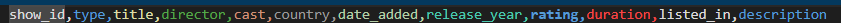

# Projet de Visualisation des Données Netflix

## Introduction

> Ce projet vise à analyser et visualiser les données du dataset Netflix, qui contient des informations détaillées sur les films et les séries disponibles sur la plateforme. En utilisant diverses bibliothèques Python, nous avons représenté les données à l'aide de différents types de graphiques pour offrir des perspectives approfondies sur le dataset.

## Format du Dataset

Le dataset est fourni sous forme de fichier CSV avec les métadonnées suivantes :

  

Types de Graphiques Utilisés, Pour une meilleure compréhension des données, nous avons employé les graphiques suivants :

1. Histogrammes : Affichent la distribution des variables numériques, telles que la répartition des notes ou des durées des films.
2. Diagrammes en Barres : Permettent de comparer des catégories, par exemple, le nombre de films par genre ou par pays.
3. Graphiques en Secteurs (Camemberts) : Illustrent la proportion des différentes catégories, comme la répartition des genres ou des notes.
4. Graphiques en Ligne : Montrent les tendances au fil du temps, par exemple, l'évolution du nombre de films ajoutés chaque année.
5. Nuages de Points (Scatter Plots) : Observons la relation entre deux variables numériques, telles que la durée des films et leur note.
